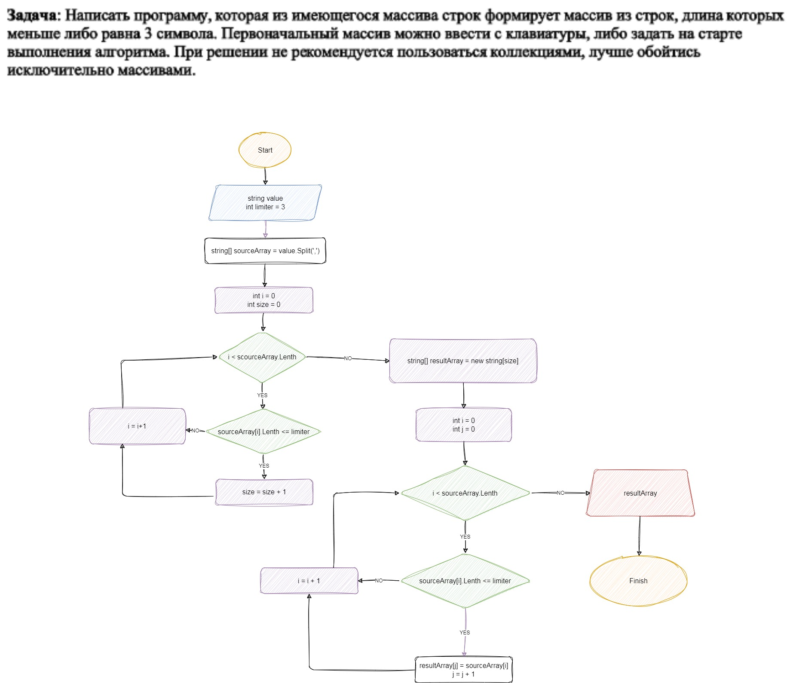

# Итоговая проверочная работа.
## Задача:
Написать программу, которая из имеющегося массива строк формирует массив из строк, длина которых меньше либо равна 3 символа. Первоначальный массив можно ввести с клавиатуры, либо задать на старте выполнения алгоритма. При решении не рекомендуется пользоваться коллекциями, лучше обойтись исключительно массивами.

## Примеры:

["hello", "2", "world", ":-)"] -> ["2", ":-)"]

["1234", "1567", "-2", "computer science"] -> ["-2"]

["Russia", "Denmark", "Kazan"] -> []

## Решение:

Получаем исходные данные в виде строки символов value, разделёных запятой, которая вводится пользователем в консоли.

Создаём массив sourceArray[] args, возвращая значение метода value.split(',').

Определяем количество удовлетворяющих нашему условию элементов (строк), содержащихся в массиве args. Помещаем это значение в переменную int size.

Создаём новый массив string[] resultArray = new string[size].

Перебираем весь массив sourceArray, проверяя значение длины каждого его элемента на соответствие нашему условию. В случае совпадения, присваиваем значение этого элемена очередному элементу массива resultArray.

Выводим на печать исходный массив.

Выводим на печать результирующий массив.

## Блоксхема решения задачи  